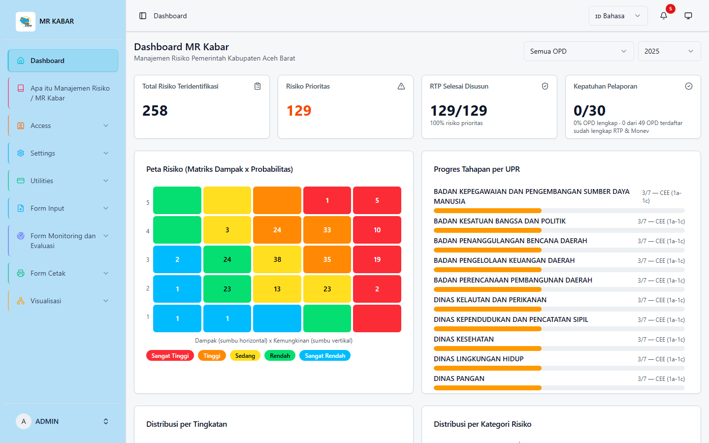
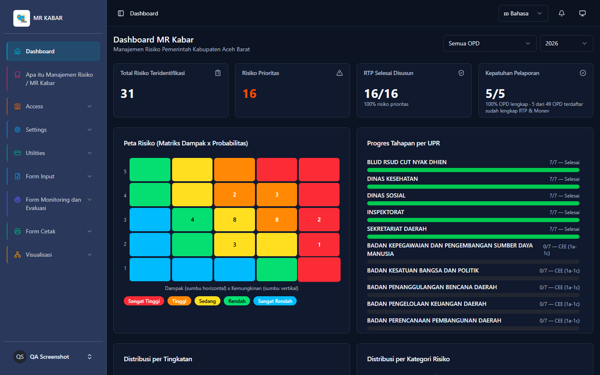
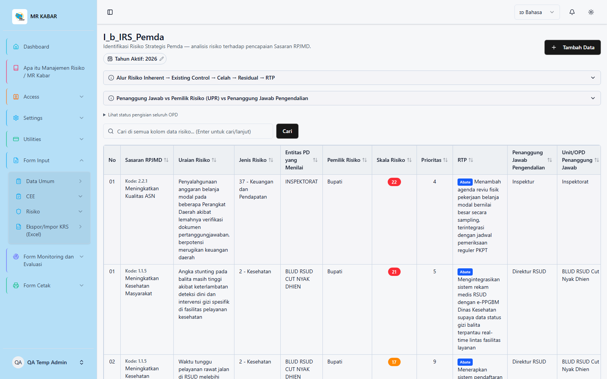
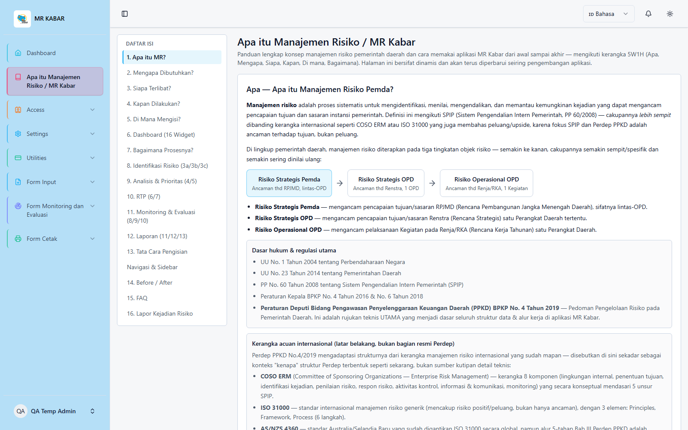
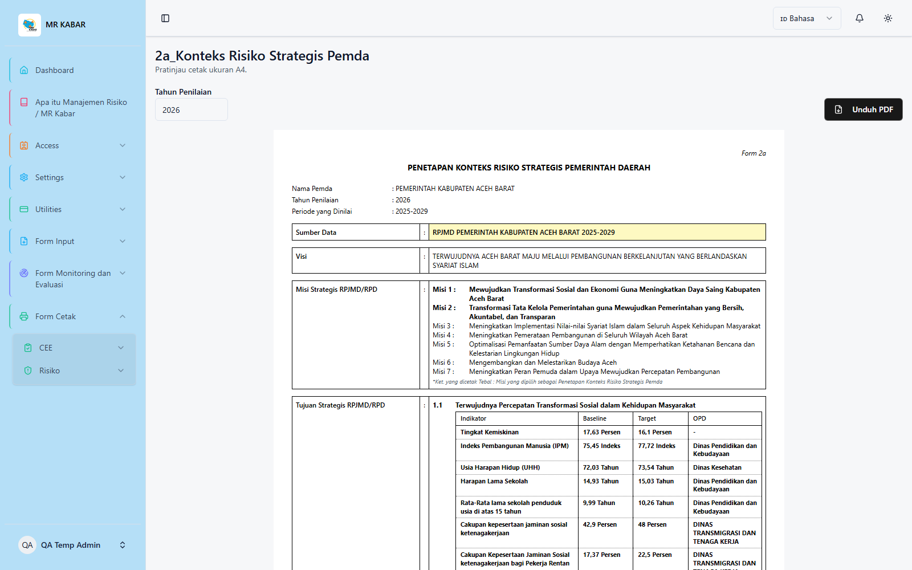
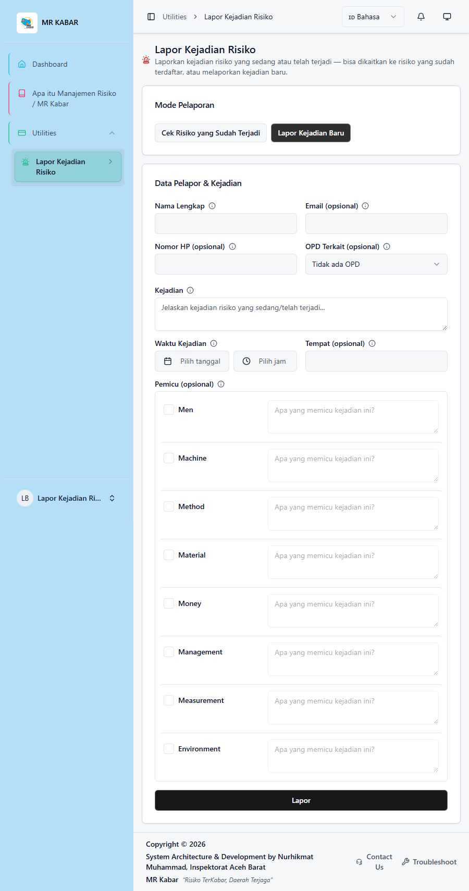

# MR Kabar

**Digitalisasi Manajemen Risiko Sektor Publik** — aplikasi web untuk mendukung pengelolaan risiko pemerintah daerah sesuai **Peraturan Deputi Bidang Pengawasan Penyelenggaraan Keuangan Daerah (PPKD) BPKP No. 4 Tahun 2019** tentang Pedoman Pengelolaan Risiko pada Pemerintah Daerah.

> *"Risiko TerKabar, Daerah Terjaga"*

---

## Tentang MR Kabar

Sebelum MR Kabar, proses identifikasi risiko strategis maupun operasional di lingkungan Perangkat Daerah (OPD) biasanya dikerjakan lewat berkas Excel/Word terpisah per OPD — rawan hilang, sulit direkap lintas-OPD, dan tanpa jejak audit yang jelas siapa mengisi apa dan kapan.

MR Kabar menggantikan proses manual tersebut dengan aplikasi web terpusat yang:

- Menstandarkan struktur data sesuai Perdep PPKD No. 4/2019 (field wajib, kode risiko, alur 5 tahap proses pengelolaan risiko).
- Menjaga keterkaitan hierarkis **Visi → Misi → Tujuan → Sasaran → Program/Kegiatan → Risiko** secara otomatis.
- Merekam siapa mengisi/mengubah apa dan kapan (audit trail), termasuk histori hapus/pulihkan data (soft delete).
- Menghasilkan visualisasi hierarki (diagram pohon) dan laporan cetak siap tanda tangan.
- Membatasi akses data sesuai kepemilikan OPD — setiap PIC hanya melihat/mengelola data OPD-nya sendiri.

Aplikasi ini mencakup tiga tingkatan risiko sesuai Perdep PPKD: **Risiko Strategis Pemda**, **Risiko Strategis Perangkat Daerah**, dan **Risiko Operasional Perangkat Daerah** — beserta penilaian **Lingkungan Pengendalian (CEE / Control Environment Evaluation)** yang menjadi fondasi sebelum penilaian risiko itu sendiri.

---

## Fitur Utama

### Manajemen Risiko (sesuai Perdep PPKD No. 4/2019)
- **KRS/IRS Pemda** — Kertas Rencana Strategis & Identifikasi Risiko tingkat Pemerintah Daerah.
- **KRS/IRS Perangkat Daerah** — untuk risiko strategis tingkat OPD (Renstra).
- **KRO/IRO Perangkat Daerah** — untuk risiko operasional tingkat Kegiatan (Renja/RKA), dengan opsi impor struktur langsung dari data KRS PD.
- **Visualisasi Hierarki** — diagram pohon interaktif yang menggabungkan struktur rencana strategis dengan risiko yang tertaut di setiap levelnya.
- **Perhitungan otomatis** Skala Risiko dan Prioritas dari matriks analisis risiko 5×5 (dampak × kemungkinan).
- **Struktur kode risiko otomatis** mengikuti format `[JENIS].[TAHUN].[URUSAN].[OPD].[NOMOR URUT]`.

### CEE (Control Environment Evaluation)
- Kuesioner persepsi 8 unsur lingkungan pengendalian (37 pertanyaan baku, skala 1–4, multi-responden dengan perhitungan modus otomatis).
- Pencatatan temuan kelemahan berdasarkan reviu dokumen (LHP, dsb).
- Simpulan akhir per unsur, siap dicetak sebagai laporan PDF bertanda tangan.

### Lapor Kejadian Risiko
- Form pelaporan publik (dapat diakses via QR code) untuk melaporkan kejadian risiko yang sedang/telah terjadi di lapangan.
- Dua mode: mengaitkan ke risiko yang sudah terdaftar, atau melaporkan kejadian baru.
- Notifikasi otomatis ke PIC OPD terkait dan Admin/Super Admin, dengan alur tindak lanjut (Baru → Diverifikasi → Ditindaklanjuti → Selesai).

### Manajemen Pengguna & Akses
- Role & permission berjenjang (Spatie Laravel Permission) — Admin, Super Admin, PIC per-OPD, dan akun bersama untuk pengisian kolaboratif (CEE, Lapor Kejadian Risiko).
- Menu dinamis berbasis role dengan drag-and-drop pengaturan urutan/nesting.
- Kepemilikan data per-OPD — data risiko satu OPD tidak terlihat/dapat diubah OPD lain.

### Utilitas Pendukung
- **File Manager** — folder pribadi per pengguna + Folder Umum (berbagi lintas-OPD) dengan alur persetujuan unggahan.
- **Data Terhapus (Trash)** — semua penghapusan data risiko bersifat *soft delete*, dapat dipulihkan kapan saja.
- **Audit Log** — jejak aktivitas pengguna di seluruh aplikasi.
- **Backup Database** — otomatis & manual, dengan pembersihan backup lama terjadwal.
- **Form Cetak** — dokumen siap tanda tangan (PDF) untuk CEE maupun laporan risiko, dihasilkan lewat Browsershot (rendering Chromium dari komponen React yang sama dengan tampilan web).
- **Panduan Aplikasi** — dokumentasi interaktif lengkap dengan diagram alur, tabel, dan visualisasi struktur di dalam aplikasi.

---

## Tampilan Aplikasi

| Dashboard (Light) | Dashboard (Dark) |
| --- | --- |
|  |  |

| Identifikasi Risiko (IRS Pemda) | Panduan Aplikasi |
| --- | --- |
|  |  |

**Form Cetak** (dokumen siap tanda tangan, dihasilkan via Browsershot)



**Lapor Kejadian Risiko** (form pelaporan publik via QR code, dengan klasifikasi penyebab 7M+1E)



---

## Tech Stack

| Area              | Teknologi                                  |
| ----------------- | ------------------------------------------- |
| Backend           | Laravel 12 (PHP 8.2+)                       |
| Frontend          | React 19 + Inertia.js + TypeScript          |
| UI Components     | ShadCN UI + TailwindCSS                     |
| Kontrol Akses     | Spatie Laravel Permission                   |
| Manajemen File     | Spatie Media Library                        |
| PDF/Cetak         | Browsershot (Puppeteer/Chromium)            |
| Database          | MySQL / MariaDB                             |

---

## Instalasi (Pengembangan Lokal)

```bash
# Clone repository
git clone https://github.com/mattwild75/MR-Kabar.git
cd MR-Kabar

# Backend
composer install
cp .env.example .env
php artisan key:generate

# Sesuaikan kredensial database & variabel lain di .env, lalu:
php artisan migrate --seed

# Frontend
npm install
npm run build   # atau `npm run dev` untuk mode pengembangan

php artisan serve
```

> **Catatan keamanan:** file `.env` tidak disertakan dalam repository (lihat `.gitignore`). Isi setiap variabel kredensial (database, mail, dsb.) sesuai lingkungan Anda sendiri — jangan pernah meng-commit `.env` yang berisi kredensial nyata.

---

## Lisensi

Proyek internal untuk mendukung pengelolaan risiko sektor publik. Hubungi pengelola repository untuk pertanyaan terkait penggunaan atau kontribusi.

---

Dikembangkan untuk mendukung implementasi manajemen risiko pemerintah daerah sesuai Perdep PPKD No. 4 Tahun 2019.
