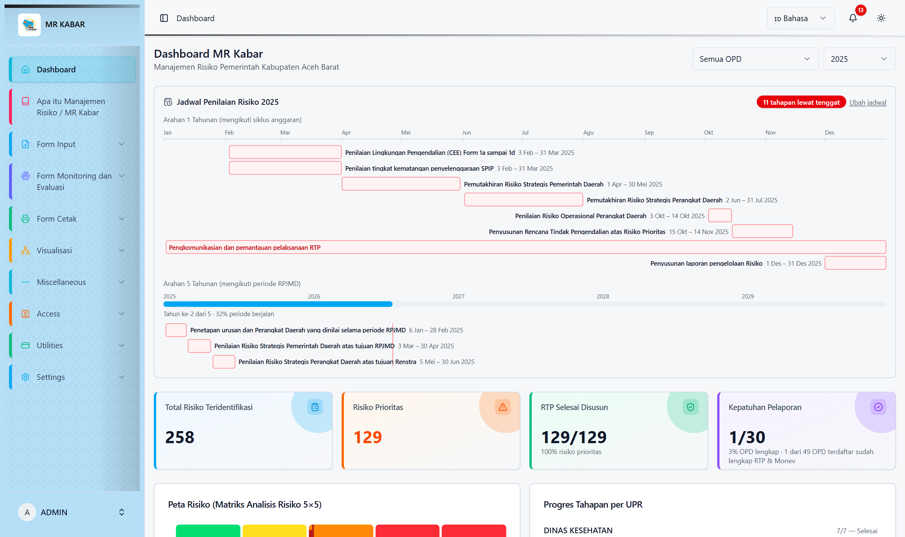
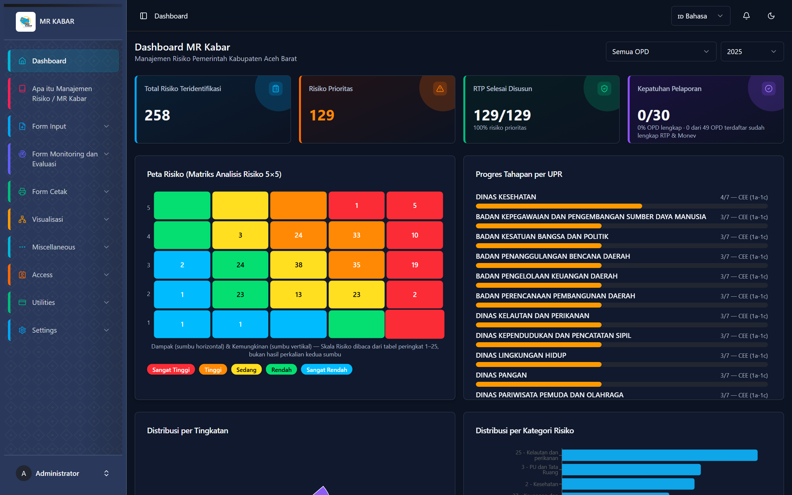
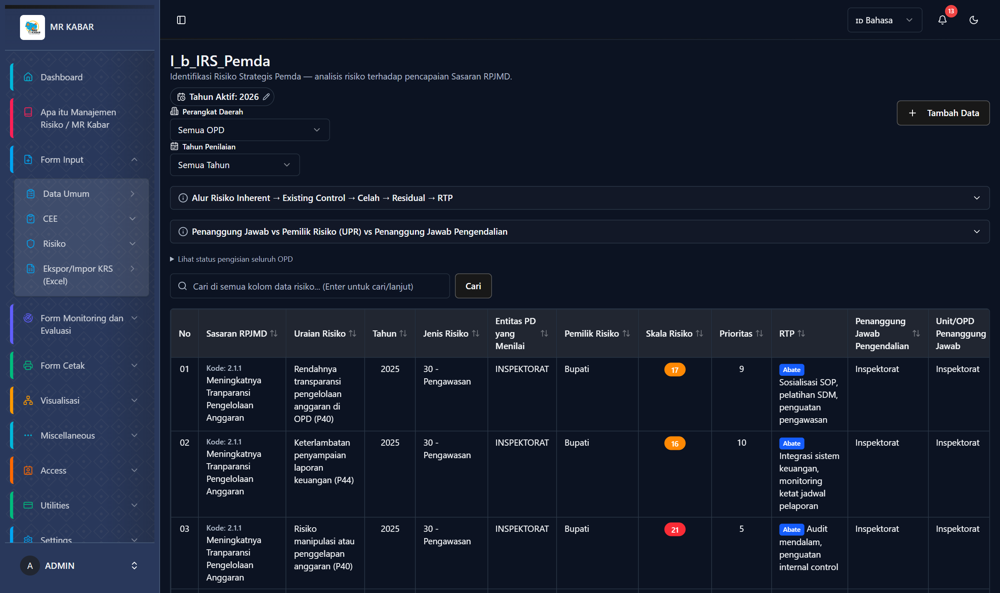
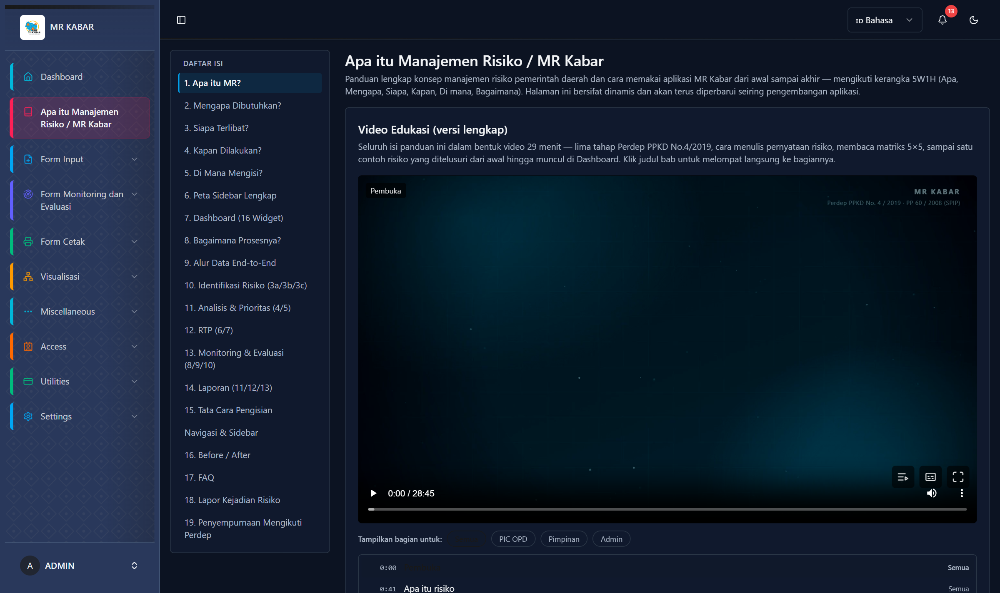
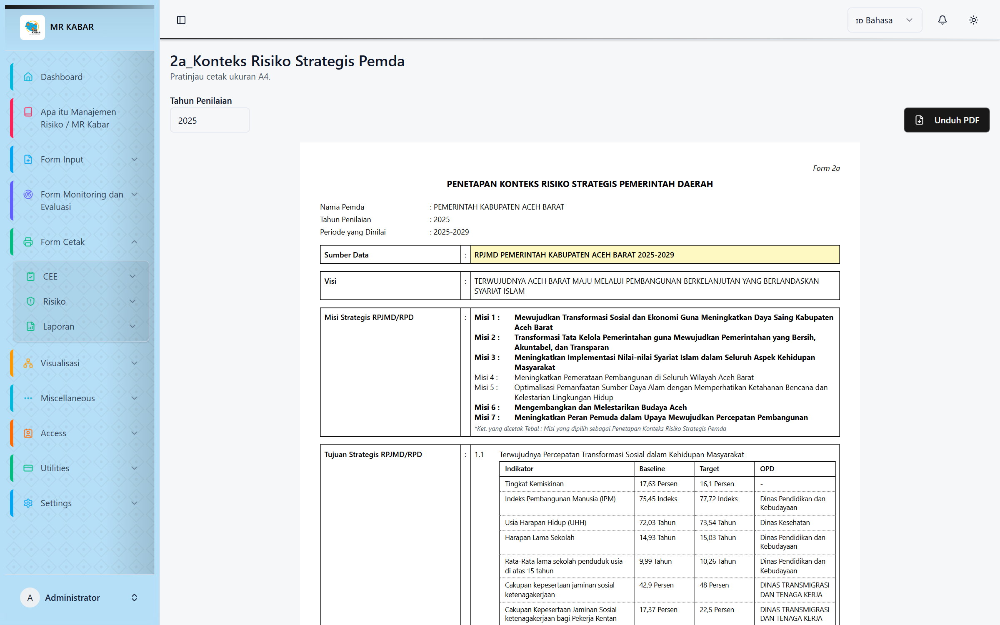
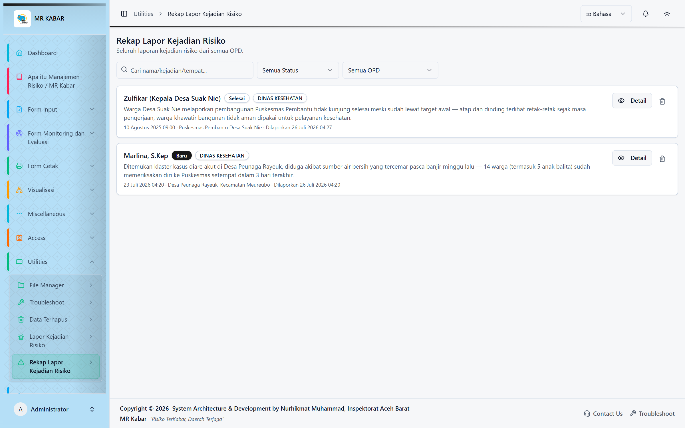
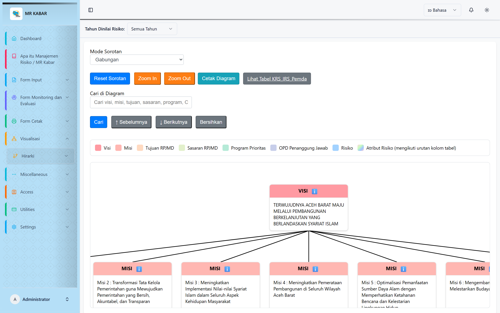
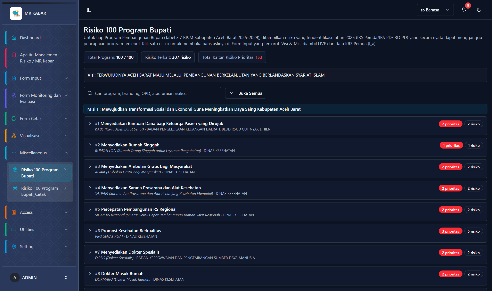

# MR Kabar

**Digitalisasi Manajemen Risiko Sektor Publik** — aplikasi web untuk mendukung pengelolaan risiko pemerintah daerah sesuai **Peraturan Deputi Bidang Pengawasan Penyelenggaraan Keuangan Daerah (PPKD) BPKP No. 4 Tahun 2019** tentang Pedoman Pengelolaan Risiko pada Pemerintah Daerah.

> *"Risiko TerKabar, Daerah Terjaga"*

---

## Tentang MR Kabar

Sebelum MR Kabar, proses identifikasi risiko strategis maupun operasional di lingkungan Perangkat Daerah (OPD) biasanya dikerjakan lewat berkas Excel/Word terpisah per OPD — rawan hilang, sulit direkap lintas-OPD, dan tanpa jejak audit yang jelas siapa mengisi apa dan kapan.

MR Kabar menggantikan proses manual tersebut dengan aplikasi web terpusat yang:

- Menstandarkan struktur data sesuai Perdep PPKD No. 4/2019 (field wajib, kode risiko, alur 5 tahap proses pengelolaan risiko).
- Menjaga keterkaitan hierarkis **Visi → Misi → Tujuan → Sasaran → Program/Kegiatan → Risiko** secara otomatis.
- Merekam siapa mengisi/mengubah apa dan kapan (audit trail), termasuk histori hapus/pulihkan data (soft delete).
- Menghasilkan visualisasi hierarki (diagram pohon) dan laporan cetak siap tanda tangan.
- Membatasi akses data sesuai kepemilikan OPD — setiap PIC hanya melihat/mengelola data OPD-nya sendiri.

Aplikasi ini mencakup tiga tingkatan risiko sesuai Perdep PPKD: **Risiko Strategis Pemda**, **Risiko Strategis Perangkat Daerah**, dan **Risiko Operasional Perangkat Daerah** — beserta penilaian **Lingkungan Pengendalian (CEE / Control Environment Evaluation)** yang menjadi fondasi sebelum penilaian risiko itu sendiri.

---

## Fitur Utama

### Manajemen Risiko (sesuai Perdep PPKD No. 4/2019)
- **KRS/IRS Pemda** — Kertas Rencana Strategis & Identifikasi Risiko tingkat Pemerintah Daerah.
- **KRS/IRS Perangkat Daerah** — untuk risiko strategis tingkat OPD (Renstra).
- **KRO/IRO Perangkat Daerah** — untuk risiko operasional tingkat Kegiatan (Renja/RKA), dengan opsi impor struktur langsung dari data KRS PD.
- **Data Risiko (IRS dan IRO) — Gabungan** — satu halaman read-only yang menampilkan ketiga tabel Identifikasi Risiko (Strategis Pemda/PD, Operasional PD) sekaligus, dengan pencarian lintas-tabel dan tombol "Lihat Data" langsung ke Form Input aslinya.
- **Klasifikasi Sumber Penyebab Risiko** — kategori Internal (7M+1E: Man/Machine/Method/Material/Money/Management/Measurement/Environment) dan Eksternal (PESTLE: Political/Economic/Social/Technological/Legal/Environmental), dengan badge warna berbeda per kategori di form input maupun laporan cetak.
- **Visualisasi Hierarki** — diagram pohon interaktif yang menggabungkan struktur rencana strategis dengan risiko yang tertaut di setiap levelnya.
- **Perhitungan otomatis** Skala Risiko dan Prioritas dari matriks analisis risiko 5×5 (dampak × kemungkinan), termasuk siklus 4-skor (Inheren → Residual → Target → Aktual).
- **Struktur kode risiko otomatis** mengikuti format `[JENIS].[TAHUN].[URUSAN].[OPD].[NOMOR URUT]`.
- **Form Monitoring & Evaluasi** — pencatatan rencana/realisasi pengkomunikasian dan pemantauan atas Rencana Tindak Pengendalian (Form 8/9), serta pencatatan kejadian risiko nyata di lapangan (Form 10).
- **Form Cetak Laporan Berjenjang** — Laporan Pelaksanaan Penilaian Risiko, Laporan Berkala Pengelolaan Risiko per triwulan, dan Laporan Pemantauan Unit Kepatuhan (Form 11/12/13), sesuai Bab IV Pelaporan Perdep.

### Risiko 100 Program Bupati
- Memetakan risiko yang teridentifikasi (IRS Pemda/IRS PD/IRO PD) terhadap 100 Program Pembangunan Bupati (Tabel 3.7 RPJM), dikelompokkan per Misi RPJMD.
- Visi & Misi diambil langsung (live) dari data KRS Pemda — tidak diduplikasi manual.
- Deteksi risiko yang mengganggu lebih dari satu program sekaligus, dengan navigasi cepat lompat-dan-sorot antar-program.
- Kaitan risiko-program dapat ditambah/dilepas langsung dari halaman ini (soft delete, dapat dipulihkan), serta versi cetak/PDF siap tanda tangan Bupati.

### CEE (Control Environment Evaluation)
- Kuesioner persepsi 8 unsur lingkungan pengendalian (37 pertanyaan baku, skala 1–4, multi-responden dengan perhitungan modus otomatis).
- Pencatatan temuan kelemahan berdasarkan reviu dokumen (LHP, dsb).
- Simpulan akhir per unsur, siap dicetak sebagai laporan PDF bertanda tangan.

### Lapor Kejadian Risiko
- Form pelaporan publik (dapat diakses via QR code) untuk melaporkan kejadian risiko yang sedang/telah terjadi di lapangan.
- Dua mode: mengaitkan ke risiko yang sudah terdaftar, atau melaporkan kejadian baru.
- Notifikasi otomatis ke PIC OPD terkait dan Admin/Super Admin, dengan alur tindak lanjut (Baru → Diverifikasi → Ditindaklanjuti → Selesai).

### Manajemen Pengguna & Akses
- Role & permission berjenjang (Spatie Laravel Permission) — Admin, Super Admin, PIC per-OPD, dan akun bersama untuk pengisian kolaboratif (CEE, Lapor Kejadian Risiko).
- **Peran Peninjau (eksekutif)** untuk pimpinan/pemangku kepentingan: melihat seluruh data lintas-OPD persis seperti Admin, tetapi tidak dapat menambah/mengubah/menghapus apa pun. Larangan menulis ditegakkan satu middleware global, sehingga fitur baru otomatis ikut terkunci tanpa perlu didaftarkan satu per satu. Area khusus Super Admin (Permissions, Roles, Menu Manager, Backup DB, Audit Log) tetap tertutup.
- Menu dinamis berbasis role dengan drag-and-drop pengaturan urutan/nesting.
- Kepemilikan data per-OPD — data risiko satu OPD tidak terlihat/dapat diubah OPD lain.

### Utilitas Pendukung
- **File Manager** — folder pribadi per pengguna + Folder Umum (berbagi lintas-OPD) dengan alur persetujuan unggahan.
- **Data Terhapus (Trash)** — semua penghapusan data risiko bersifat *soft delete*, dapat dipulihkan kapan saja.
- **Audit Log** — jejak aktivitas pengguna di seluruh aplikasi.
- **Backup Database** — otomatis & manual, dengan pembersihan backup lama terjadwal.
- **Form Cetak** — dokumen siap tanda tangan (PDF) untuk CEE maupun laporan risiko, dihasilkan lewat Browsershot (rendering Chromium dari komponen React yang sama dengan tampilan web).
- **Panduan Aplikasi** — dokumentasi interaktif lengkap dengan diagram alur, tabel, dan visualisasi struktur, termasuk versi publik yang bisa diakses siapa saja tanpa login lewat halaman Masuk.
- **Video Edukasi (±23 menit)** — pengenalan manajemen risiko sektor publik mengikuti lima tahap Perdep PPKD No.4/2019, dengan daftar 20 bab yang bisa diklik, penyaring bagian sesuai peran (PIC OPD / Pimpinan / Admin), subtitle yang dapat dimatikan dan diatur ukurannya, transkrip bertimestamp, unduhan versi 720p untuk sosialisasi luring, potongan klip per tahap, serta uji pemahaman 5 pertanyaan. Narasi, musik, dan efek suara dikirim sebagai tiga jalur audio terpisah sehingga balance-nya dapat diatur dari App Settings tanpa render ulang.

---

## Tampilan Aplikasi

| Dashboard (Light) | Dashboard (Dark) |
| --- | --- |
|  |  |

| Identifikasi Risiko (IRS Pemda) | Panduan Aplikasi |
| --- | --- |
|  |  |

**Form Cetak** (dokumen siap tanda tangan, dihasilkan via Browsershot)



**Lapor Kejadian Risiko** (form pelaporan publik via QR code, dengan klasifikasi penyebab 7M+1E)



**Visualisasi Hierarki** (diagram pohon interaktif Visi → Misi → Tujuan → Sasaran → Program → Risiko)



**Risiko 100 Program Bupati** (peta risiko terhadap 100 Program Pembangunan Bupati, dikelompokkan per Misi RPJMD)



---

## Tech Stack

| Area              | Teknologi                                  |
| ----------------- | ------------------------------------------- |
| Backend           | Laravel 12 (PHP 8.2+)                       |
| Frontend          | React 19 + Inertia.js + TypeScript          |
| UI Components     | ShadCN UI + TailwindCSS                     |
| Kontrol Akses     | Spatie Laravel Permission                   |
| Manajemen File     | Spatie Media Library                        |
| PDF/Cetak         | Browsershot (Puppeteer/Chromium)            |
| Database          | MySQL / MariaDB                             |

---

## Instalasi (Pengembangan Lokal)

```bash
# Clone repository
git clone https://github.com/mattwild75/MR-Kabar.git
cd MR-Kabar

# Backend
composer install
cp .env.example .env
php artisan key:generate

# Sesuaikan kredensial database & variabel lain di .env, lalu:
php artisan migrate --seed

# Frontend
npm install
npm run build   # atau `npm run dev` untuk mode pengembangan

php artisan serve
```

> **Catatan keamanan:** file `.env` tidak disertakan dalam repository (lihat `.gitignore`). Isi setiap variabel kredensial (database, mail, dsb.) sesuai lingkungan Anda sendiri — jangan pernah meng-commit `.env` yang berisi kredensial nyata.

---

## Lisensi

Proyek internal untuk mendukung pengelolaan risiko sektor publik. Hubungi pengelola repository untuk pertanyaan terkait penggunaan atau kontribusi.

---

Dikembangkan untuk mendukung implementasi manajemen risiko pemerintah daerah sesuai Perdep PPKD No. 4 Tahun 2019.
